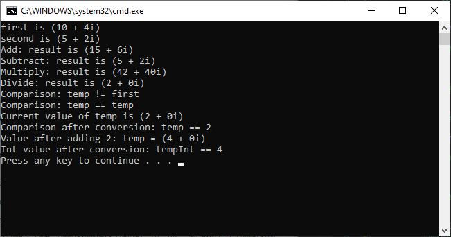

# Complex Numbers Lab
Microsoft Visual C# Step by Step Ninth Edition\
Chapter 22 - Operator overloading\
p(511 - 521)

## Solution
During this assignment, we implemented a class that is supposed to simulate complex number. NOTE: There is a type called Complex, but this assignment is for instructive purposes. In the assignment, the +, -, *, /, ==, and != were overloaded.

